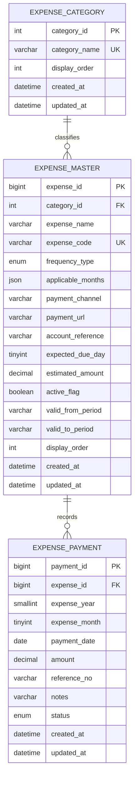

# Personal Monthly Expense Tracker -- Database ER Diagram

This ERD is synchronized with `backend/schema.sql`, which is the executable
database definition for the generated application.

## Relationships and constraints

### `expense_category`

Optional grouping for dashboard rows. `category_name` is unique. Deleting a
category sets `expense_master.category_id` to `NULL`.

### `expense_master`

Stores the 43 seeded expense rows plus rows added through
`POST /api/master/expenses`.

- `frequency_type` is one of `MONTHLY`, `BI_MONTHLY`, `QUARTERLY`,
  `SEMI_ANNUAL`, `ANNUAL`, `CUSTOM_MONTHS`, or `AD_HOC`.
- `applicable_months` is a JSON array of calendar month numbers from 1 to 12.
- `payment_channel` is intended for `WEB`, `APP`, `UPI`, `OFFLINE`, or `NA`.
- `active_flag` is the current soft-delete flag.
- `valid_from_period` and `valid_to_period` are available for period history,
  but the current dashboard query only applies `active_flag`.

### `expense_payment`

Stores one payment per expense and expense period. The unique key on
`(expense_id, expense_year, expense_month)` supports the payment upsert used
by `POST /api/payments`. `amount > 0` and month 1..12 are enforced by database
checks. `idx_period_status` supports monthly paid-total queries.

## Seed data

`schema.sql` seeds 43 items from the `Monthly-expenses` workbook sheet with
categories, recurrence months, payment channels, URLs, references, display
order, and default due days. The current frontend and backend load this data
from MySQL; the frontend's static catalog is only a pre-API fallback/reference
inside the generated UI source.

## Current limitations

- No workbook import table or migration history is defined.
- Payment status is written as `PAID`; `PENDING` is a dashboard display state
  when no payment exists, while `SKIPPED` exists in the enum but has no UI/API
  action.
- There is no audit-history table.
- The schema grants the application user all privileges on the application
  database for local setup. Production least-privilege hardening remains work.