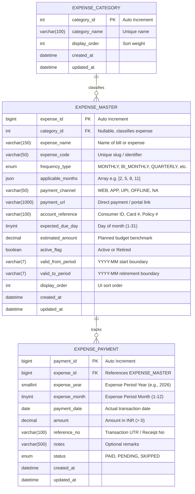

# Personal Monthly Expense Tracker -- Database ER Diagram

This document contains the Entity Relationship Diagram (ERD) and relational schema specification for the Personal Monthly Expense Tracker.

## 1. Visual Entity Relationship Diagram (Mermaid)

---

## 2. Table Specifications and Constraints

### Table: `expense_category`
- **Purpose:** Groups related bills (e.g., Utilities, Insurances, Maintenance, Household).
- **Primary Key:** `category_id` (`INT AUTO_INCREMENT`)
- **Key Constraints:**
  - `category_name`: `VARCHAR(100) NOT NULL UNIQUE`

### Table: `expense_master`
- **Purpose:** Stores configurable expense row metadata, dynamic recurrences, URLs, and payment criteria.
- **Primary Key:** `expense_id` (`BIGINT AUTO_INCREMENT`)
- **Foreign Key:** `category_id` references `expense_category(category_id)` on delete `SET NULL`.
- **Key Constraints & Rules:**
  - `frequency_type`: `ENUM('MONTHLY', 'BI_MONTHLY', 'QUARTERLY', 'SEMI_ANNUAL', 'ANNUAL', 'CUSTOM_MONTHS', 'AD_HOC') NOT NULL`
  - `applicable_months`: Validated JSON array containing month integers ($1 \le m \le 12$).
  - `active_flag`: Defaults to `TRUE`. When set to `FALSE`, the item is omitted from future months.
  - `valid_from_period` / `valid_to_period`: Format `YYYY-MM`. Prevents deleted/retired items from polluting current views while retaining past associations.

### Table: `expense_payment`
- **Purpose:** Transactional ledger of actual payments made.
- **Primary Key:** `payment_id` (`BIGINT AUTO_INCREMENT`)
- **Foreign Key:** `expense_id` references `expense_master(expense_id)` on delete `RESTRICT`.
- **Key Constraints & Rules:**
  - `uq_expense_period`: `UNIQUE KEY (expense_id, expense_year, expense_month)` ensures an expense cannot be paid twice for the same billing period without an explicit edit.
  - `chk_expense_payment_amount`: `CHECK (amount > 0)`
  - `chk_expense_payment_month`: `CHECK (expense_month BETWEEN 1 AND 12)`
  - `idx_period_status`: Composite index on `(expense_year, expense_month, status)` for sub-millisecond monthly total computation.